<p align="right">
   <a href="./README.md">EN</a> | <a href="./README.zh-CN.md">简</a> | <a href="./README.zh-TW.md">繁</a> | <a href="./README.ko.md">KO</a> | <strong>JA</strong>
</p>
<div align="center">
    
    <h1>Token Monitor</h1>
</div>

<p align="center">
    <em>すべての AI コーディングツールのリアルタイム使用量を一画面で、複数デバイス間で同期。</em>
</p>

<p align="center">
    <a href="https://github.com/IGNGserver/token-monitor-suite/releases"></a>
    <a href="https://github.com/IGNGserver/token-monitor-suite/releases"></a>
    
    
    
    <a href="LICENSE"></a>
</p>

<div align="center">
    
</div>

## Token Monitor とは

Claude Code、Codex、Cursor、GitHub Copilot など 59+ 種類の AI コーディングツールのリアルタイムトークン使用量と AI ツール制限を表示するデスクトップアプリです。複数デバイス間のリアルタイム同期、使用履歴トレンド、ツール・デバイス・モデル・セッション・プロジェクト別の内訳表示に対応しています。

## 対応ツール

Token Monitor は **トークン使用量**、**アカウント制限**、**セッション詳細** を個別にサポートします。

| Logo | ツール | データパス | トークン使用量 | AI ツール制限 | セッション詳細 |
|:---:|------|-----------|:---:|:---:|:---:|
|  | Claude Code | `~/.claude/projects/`, `~/.claude/transcripts/` | ✅ | ✅ | ✅ |
|  | Claude Desktop | `<platform-app-data>/Claude/` と `Claude-3p/`（Local Agent / Cowork トランスクリプト） | ✅ | — | ✅ |
|  | Codex | `~/.codex/`（`sessions/`、`archived_sessions/`） | ✅ | ✅ | ✅ |
|  | OpenCode | `~/.local/share/opencode/`（`opencode*.db`、`storage/message/`） | ✅ | ✅ | ✅ |
|  | Hermes Agent | `~/.hermes/state.db` | ✅ | — | — |
|  | OpenClaw | `~/.openclaw/agents/` | ✅ | — | — |
|  | Cursor | `~/.config/tokscale/cursor-cache/` | ✅ | ✅ | — |
|  | Antigravity | `~/.gemini/`（`antigravity/`、`antigravity-ide/`、`antigravity-backup/`、`antigravity-cli/conversations/`） | ✅ | ✅ | — |
|  | Cline | VS Code globalStorage tasks (`.../saoudrizwan.claude-dev/tasks/`)、`~/.cline/data/sessions/` | ✅ | ✅ | — |
|  | Kimi CLI / Kimi Code | `~/.kimi/sessions/`, `~/.kimi-code/sessions/` | ✅ | ✅ | — |
|  | Qwen CLI | `~/.qwen/projects/` | ✅ | — | — |
|  | Grok Build | `~/.grok/`（`sessions/`、`logs/unified.jsonl`） | ✅ | ✅ | — |
|  | GitHub Copilot | VS Code `workspaceStorage/*/chatSessions/`、`~/.copilot/`（`otel/`、`data.db`） | ✅ | ✅ | — |
|  | Pi / Oh My Pi | `~/.pi/agent/sessions/`, `~/.omp/agent/sessions/` | ✅ | — | — |
|  | Zed | `~/.local/share/zed/threads/threads.db` | ✅ | — | — |
|  | Kilo Code | VS Code globalStorage tasks (`.../kilocode.kilo-code/tasks/`) — Linux およびリモート/WSL のみ | ✅ | ✅ | — |
|  | Command Code | `~/.commandcode/projects/**/*.jsonl` | ✅ | ✅ | — |
|  | MiMo Code | `~/.local/share/mimocode/mimocode.db`（Claude Code のセッションを取り込むため、tokscale が重複排除せず Claude の合計が二重計上される場合があります） | ✅ | ✅ | — |
|  | ZCode / GLM | `~/.zcode/`（`projects/`、`cli/db/db.sqlite`） | ✅ | ✅ | — |
|  | Kiro | `~/.kiro/sessions/cli/`, Kiro IDE globalStorage および `kiro-cli` DB | ✅ | ✅ | — |
|  | CodeBuddy | `~/.codebuddy/projects/` + IDE / VS Code 拡張ログ | ✅ | — | — |
|  | WorkBuddy | `~/.workbuddy/projects/`, `~/.workbuddy/workbuddy.db` | ✅ | — | — |
|  | Proma | `~/.proma/agent-sessions/*.jsonl` | ✅ | — | — |
|  | DeepSeek Harness | `$DSH_HOME/sessions/`（デフォルト `~/.dsh/sessions/`、`session.jsonl[.zstd]` およびバージョン付き `session.v<N>.jsonl[.zstd]`） | ✅ | — | — |
|  | Qoder / Qoder CN | ローカルアダプター、エディションごとに自動収集：`~/.qoder/projects/` と `~/.qoder-cn/projects/` transcript、および存在する場合の `<platform-app-data>/Qoder/` と `QoderCN/SharedClientCache/cache/db/local.db`、`com.qoder.app.stable/` と `com.qodercn.app.stable/main.sqlite`；Qoder dashboard cookie（Qoder usage API で big-model credits 取得） | ✅ | ✅ | — |
|  | Reasonix | `~/.reasonix/`（`stats/`、`sessions/`、`projects/*/sessions/`） | ✅ | — | ✅ |
| 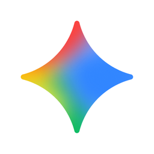 | Gemini CLI | `~/.gemini/tmp/` | ✅ | ✅ | — |
| 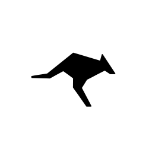 | Roo Code | VS Code globalStorage tasks (`.../rooveterinaryinc.roo-cline/tasks/`) | ✅ | — | — |
|  | Amp | `~/.local/share/amp/threads/` | ✅ | ✅ | — |
|  | Droid | `~/.factory/sessions/` | ✅ | ✅ | — |
|  | Mux | `~/.mux/sessions/` | ✅ | — | — |
| 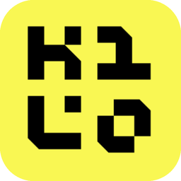 | Kilo CLI | `~/.local/share/kilo/kilo.db` | ✅ | — | — |
| 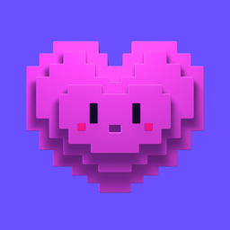 | Crush | `~/.local/share/crush/projects.json` | ✅ | — | — |
|  | Goose | `~/.local/share/goose/sessions/sessions.db` | ✅ | — | — |
| 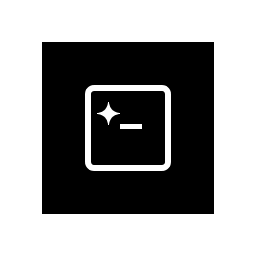 | Codebuff / Freebuff | `~/.config/manicode/projects/`（`chats/*/chat-messages.json`） | ✅ | — | — |
| 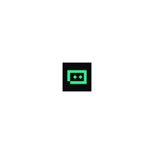 | Trae | `~/.config/tokscale/trae-cache/`（`tokscale trae sync` 実行後） | ✅ | — | — |
|  | Warp / Oz | `~/.config/tokscale/warp-cache/`（`tokscale warp sync` 実行後） | ✅ | ✅ | — |
| 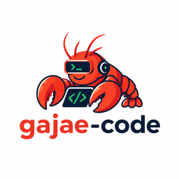 | Gajae-Code | `~/.gjc/agent/sessions/` | ✅ | — | — |
| 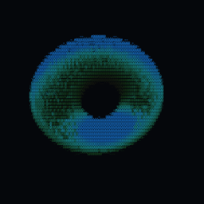 | Jcode | `~/.jcode/sessions/` | ✅ | — | — |
|  | Junie | `~/.junie/sessions/` | ✅ | — | — |
|  | OpenCodeReview | `~/.opencodereview/sessions/` | ✅ | — | — |
| 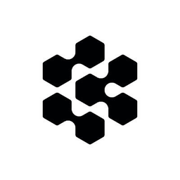 | Devin CLI / Devin Desktop | `~/.local/share/devin/cli/sessions.db`, `~/Library/Application Support/Devin/User/acp-events/`（macOS） | ✅ | — | — |
|  | Senpi | `~/.senpi/agent/sessions/` | ✅ | — | — |
|  | Augment Code | `~/.augment/sessions/` | ✅ | — | — |
| 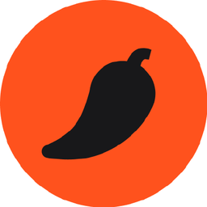 | Kimchi | `~/.config/kimchi/harness/sessions/` | ✅ | — | — |
|  | Prime Agent | `~/.prime/agent/sessions/` | ✅ | — | — |
|  | Cherry Studio | `~/.config/CherryStudio/.claude/projects/` | ✅ | — | — |
| 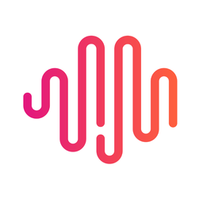 | MiniMax Code | `~/.config/tokscale/headless/mcode/` | ✅ | — | — |
|  | Fx | `~/.fx/sessions/` | ✅ | — | — |
| 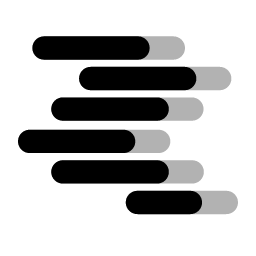 | LM Studio | `~/.lmstudio/server-logs/`（最終応答の使用量のみ、ローカル推論は $0） | ✅ | — | — |
|  | Unsloth | `~/.unsloth/studio/studio.db` | ✅ | — | — |
|  | Hindsight | `~/.hindsight/usage/` | ✅ | — | — |
|  | DeepSeek | DeepSeek API キー（DeepSeek API で残高取得） | — | ✅ | — |
|  | OpenRouter | OpenRouter API キー（使用量／キー上限。creditsアクセス許可時は残高も表示。公式文書ではManagementキーを指定） | — | ✅ | — |
|  | Minimax | Minimax API キー（Minimax API で Token Plan クォータ取得） | — | ✅ | — |
|  | Volcengine | Ark API key または Volcengine AK/SK（Volcengine API で Ark Coding Plan クォータ取得） | — | ✅ | — |
|  | Ollama | Ollama Cloud cookie（ollama.com/settings で session/weekly 使用量を取得） | — | ✅ | — |
|  | サードパーティAPI | New API互換アカウントプリセット（互換性のあるOne APIフォークを含む）、New APIキープリセット、宣言型カスタム残高エンドポイント | — | ✅ | — |
| 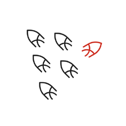 | Sakana (Fugu) | Sakana の課金コンソールの session cookie | — | ✅ | — |

<details>
<summary><strong>注意事項、Custom 残高エンドポイント、環境変数で変更したデータパス</strong></summary>

<br>

- 上記はデフォルトのパスです。Token Monitor は Tokscale と同じ環境変数の上書きに従います。`~/.local/share/` 配下は `$XDG_DATA_HOME`、ツール個別では `$CODEX_HOME`、`$GROK_HOME`、`$HERMES_HOME`、`$KIMI_CODE_HOME`、`$REASONIX_STATE_HOME`、`$REASONIX_HOME`、`$CLINE_*` などです。

- Command Code の transcript には実際のトークン数やメッセージごとのモデル情報が含まれません。トークン使用量は transcript テキストから推定され、モデルの帰属と推定コストには各リクエストで過去に使用したモデルではなく、現在設定されているモデルが反映される場合があります。

- Custom は1つの GET 残高エンドポイントから数値 JSON フィールドをマッピングします。OpenAI または Anthropic API 互換だけでは不十分です。

#### Qoder / Qoder CN（ローカルアダプター）

Qoder のトークン使用量は API ではなくアプリ自身のローカルファイルから読み取ります。国際版と中国版はプロファイルが分かれているため、`qoder` と `qodercn` の2つの独立したクライアントとして追跡します。どちらも自動的に追跡されます（ツール単位のオプトインはありません）。各エディションで3つのソースを調べ、実在するものが寄与します：

- **Transcript ディレクトリ — 現在のビルドでの主要ソース。** `~/.qoder/projects/**/*.jsonl`（国際版）または `~/.qoder-cn/projects/**/*.jsonl`（中国版）、リクエストごとに JSON 1行。ライブ更新のため監視され、必要なのはファイルシステムだけです。別のルートを指すには `TOKEN_MONITOR_QODER_TRANSCRIPTS_DIR` / `TOKEN_MONITOR_QODER_CN_TRANSCRIPTS_DIR` を、プロファイル全体を移動している場合は Qoder CN 自身の `QODERCN_CONFIG_DIR` を設定してください。
- **デスクトップのメッセージストア。** プラットフォームのアプリケーションサポートディレクトリ下の `com.qoder.app.stable/main.sqlite`（国際版）または `com.qodercn.app.stable/main.sqlite`（中国版）。`TOKEN_MONITOR_QODER_MAIN_DB_PATH` / `TOKEN_MONITOR_QODER_CN_MAIN_DB_PATH` で上書きできます。Qoder CN 0.1.x は国際版の表記を使っていたため、中国版は両方の候補を順に試します。
- **旧キャッシュデータベース。** `<platform-app-data>/Qoder/SharedClientCache/cache/db/local.db`（国際版）、中国版は `QoderCN/` 下の同じパス — macOS `~/Library/Application Support/`、Windows `%APPDATA%\`、Linux `~/.config/`。`TOKEN_MONITOR_QODER_DB_PATH` / `TOKEN_MONITOR_QODER_CN_DB_PATH` で上書きできます。

`com.qoder.app.stable` は両エディションが主張するため、あるエディションは自分自身の痕跡（アプリケーションサポートディレクトリまたはプロファイルディレクトリ）も実在する場合にのみ読み取ります：国際版だけのマシンが `qodercn` に計上されることはなく、Qoder CN 0.1.x だけのマシンが `qoder` に計上されることもありません。どのソースが実在するかはエディションとインストール形態によって異なります — 本記述を確認した Linux マシン（2026-09-26、Qoder CN 0.4.2）では、中国版は transcript と `com.qodercn.app.stable/main.sqlite` を持ち旧キャッシュデータベースはなく、国際版は CLI のみのインストールで transcript だけでした。

各ソースの行はリクエスト識別子で加算的にマージされ、重複排除されます。transcript の行がデータベースの行と異なると証明できない場合はデータベースの行が優先されます — 重なる2つのソースを二重計上してはいけません。

これは高度なローカル統合です。2つの SQLite ソースには PATH 上の `sqlite3` CLI、またはフラグ不要の `node:sqlite` を備えた Node ランタイム（Node ≥ 23.4、Electron では CLI が必要な場合あり）が必要ですが、transcript ディレクトリにはどちらも不要です。読み取りエラーはログに記録され、完全な既存スナップショットがあればゼロ使用量で上書きせず保持します。Main SQLite と Transcript の行は CJK 文字数 / 1.5 とその他の文字数 / 4 の混合式で推定します。リクエストの入力は**直前のリクエスト以降**に追加された会話内容、出力はそのリクエストに保存された内容で、session の各メッセージは後続のリクエストごとに再加算されず 1 度だけ計上されます。ローカルレコードにはプロバイダーの請求フィールド、システムプロンプト、ツール schema がないため、これらの使用量とコストには `estimated` が付き、正確な請求 Token ではありません。コストはマッピングされた各モデルの models.dev カタログ料金から推定されます。Qoder がディスク形式を変更すると動作しなくなる可能性があります。

この記録の中にひとつだけ推定ではない数値があります。Qoder はトークンではなくクレジットで課金します — usage ブロックのトークン欄はすべて `0` のまま、正確なリクエスト単位の `credits` 値を併せて公開するのです — そのため Qoder のツール行は、`~` の付いたトークンとコストの隣に実際のクレジット消費量を表示します。クレジットの適用範囲は Qoder 使用量そのものと完全に一致し、それは 今日 / 今月 / 合計 の各タブです：昨日と今週のカスタム範囲は現時点で Qoder を一切含みません（このスキャンは Tokscale 対応ツールと Proma / Claude Desktop が対象です）。また Hub で保存済み履歴から回答される範囲もクレジットを報告しません。

#### Qoder アカウント制限

`qoder` の制限アカウントは Hub に手動で追加します。上記のローカル使用量アダプターとは別です。Hub は入力された認証情報を暗号化して保存し、アカウント制限を自動更新して、正規化した結果を接続中のデバイスへ配布します。デバイス側ではローカル Qoder ログイン、ブラウザプロファイル、環境認証情報、CLI アカウントの自動検出を削除しており、それらの認証情報を送信したり制限の情報源にしたりしません。
</details>

## ショーケース

<table>
<tr>
<td width="290" align="center"><br><sub>カスタマイズ可能なダッシュボード — 表示するモジュールと順序を選択</sub></td>
<td width="290" align="center"><br><sub>Hub 管理アカウントと各デバイスに配布される最新制限</sub></td>
<td width="290" align="center"><br><sub>任意のツールをクリックして入力／出力とキャッシュヒットの内訳を展開</sub></td>
</tr>
<tr>
<td width="290" align="center"><br><sub>単一セッションを開いて、プロンプトごとにトークンと使用ツールを分解</sub></td>
<td width="290" align="center"><br><sub>ツール横断で各モデルの使用量とコストを集計</sub></td>
<td width="290" align="center"><br><sub>各デバイスの使用量・コスト・同期状態、展開でマシン別詳細</sub></td>
</tr>
</table>

<table>
<tr>
<td width="435" align="center"><br><sub>全デバイス横断の 1 年分アクティビティヒートマップと連続日数</sub></td>
<td width="435" align="center"><br><sub>1 年分の日次トレンド、ツール／モデル別に積み上げ、K 線対応</sub></td>
</tr>
</table>

## Token Monitor を使う理由

多くの使用量モニターは、実行しているマシン上でのみ役立ちます。Token Monitor はマルチデバイス作業のために設計されています。各デバイスがローカルログを監視し、hub にサマリーを送信すると、接続されたすべてのクライアントがトークンの変化をほぼリアルタイムで確認できます。

## 機能

### 使用量の追跡

- **リアルタイムトークン追跡** — Claude Code、Codex、Cursor、GitHub Copilot、Antigravity、OpenCode など 52+ 種類の AI ツール、各ターンから数秒以内に UI 更新（全リストは上の表を参照）
- **セッション別詳細** — Claude Code、Claude Desktop、Codex、OpenCode、Reasonix セッションで
- **キャッシュヒット統計** — ツール・モデルをクリックすると入力トークン（キャッシュ hit/miss）、出力トークン、ヒット率の詳細
- **コストと通貨** — トークン数とともにコストを表示。USD、TWD、HKD、CNY に対応し、為替レートは毎日自動更新、設定で手動上書き可能
- **WSL 使用量 (Windows)** — 実行中の WSL ディストリビューションにあるファイルベースの使用量を約 5 分ごとに自動検出して合算。OpenCode や Hermes など SQLite ベースのツールでは、[WSL 内のヘッドレスエージェント](docs/wsl-sqlite-setup.md)が必要になる場合があります

### 制限・トレンド・エクスポート

- **AI ツール制限検出** — Claude Code、Codex、Cursor、OpenRouter、サードパーティAPI、GLM、Kimi など 26+ プロバイダーの session/weekly/billing/credits、複数の OpenRouter／サードパーティプロファイル、DeepSeek プリペイド残高と使用額
- **Hub 管理のアカウント制限** — プロバイダーごとに複数アカウントを手動追加し、認証情報を Hub だけに保存。Hub が制限を更新し、接続中のすべてのデバイスへ配布
- **削除されたセッション使用量を保持** — 多くのツールは古いセッションを削除します（Claude Code はデフォルトで 30 日後にトランスクリプトを削除）。有効にすると、Token Monitor は観測済みの日別ツール/モデル使用量をローカルにアーカイブし、元ファイルが消えてもヒートマップとトレンドを維持します（下記 [セッションデータの保持期間](#セッションデータの保持期間) を参照）
- **使用トレンド** — ホーム画面のアクティビティヒートマップ・トレンドチャート、およびトレンドビューの連続日数と全デバイス横断のツール/モデル別累積使用（棒・K 線）
- **データエクスポート** — ツール非依存の CSV + JSON で手動エクスポートまたはフォルダへの自動書き込み（スプレッドシート、Obsidian、Grafana、スクリプト用）；[docs/export.md](docs/export.md) を参照
- **サブスクリプション記録** — 各 AI アカウントの実際の費用を手動で記録します。プランラベルのツールチップに料金、次回更新日または終了日、利用期間、当月の使用量コストが支払額の何倍かが表示され、定期プランとチャージ履歴のどちらにも対応

### マルチデバイスとデプロイ

- **マルチデバイスリアルタイム同期** — Server-Sent Events。1 台の変更が数秒以内に他のデバイスに反映
- **ローカルファースト** — 単一デバイスではサーバー不要
- **セルフホスト同期** — Docker Compose Hub
- **プライバシー優先** — プロンプト、応答、ソースコード、ファイル内容はすべてデバイス内に保持

### インターフェースと表示

- **内訳ビュー** — ツール、デバイス、モデル、セッション、プロジェクト、アカウント制限別
- **1 つの UI、2 つのホスト** — デスクトップアプリと Hub の Web ダッシュボードが同じ UI を描画するため、アプリを入れていないマシンでもブラウザで完全なダッシュボードを開けます
- **外観** — テーマ（ライトモード含む）、ツール別カラー、ネイティブのウィンドウ背景効果
- **デスクトップ設定** — 言語、ウィンドウ素材とモーション、起動/トレイ動作、アップデート、ハブ接続、デバイスデータ転送
- **Discord Rich Presence** — 本日のトークン・コスト・主要クライアント（オプトイン）

## インストール

[GitHub Releases](https://github.com/IGNGserver/token-monitor-suite/releases) からダウンロードできます。

- **macOS (Apple Silicon)** — `.dmg`、署名および notarize 済み
- **macOS (Intel)** — x64 `.dmg`、署名および notarize 済み
- **Windows 10/11** — インストーラー版とポータブル版の `.exe`、[署名済み](docs/code-signing.md)
- **Linux x64** — `.AppImage`、または `.deb` パッケージ
- **Linux x64（自動アップデート）** — APT リポジトリを追加するとパッケージマネージャーがアップデートを担当します（インストール前に同じディレクトリの `token-monitor-archive-keyring-fingerprint.txt` で鍵の指紋を照合してください）：
  ```bash
  curl -fsSL https://igngserver.github.io/token-monitor-suite/apt/token-monitor-archive-keyring.asc \
    | gpg --dearmor \
    | sudo tee /usr/share/keyrings/token-monitor-archive-keyring.gpg >/dev/null
  curl -fsSL https://igngserver.github.io/token-monitor-suite/apt/token-monitor.sources \
    | sudo tee /etc/apt/sources.list.d/token-monitor.sources >/dev/null
  sudo apt update && sudo apt install token-monitor
  ```
- **Android** — `Token-Monitor-Android-<version>.apk`。Docker Compose Hub のデータを表示する読み取り専用クライアント
- **GUI なし／サーバー** — `Token-Monitor-Headless-<version>.tar.gz`。Node.js 22.13+ と `npm ci --omit=dev` でインストール

パッケージ版は GitHub Releases を自動確認します。新しいバージョンがある場合は画面に更新インジケーターが表示され、対応プラットフォームでは 設定 → 起動と更新 からもインストールできます。

### 初回起動

ローカルモードがデフォルトです。アプリを起動すると、このデバイスの追跡を開始します。hub、agent、設定は不要です。

## マルチデバイス同期

マルチデバイス同期を使う場合は、すべてのデバイス（アプリを入れていない headless agent を含む）を同じ Docker Compose Hub に接続します。各デバイスでアプリを開き、設定 → ハブ接続 で **ハブに接続** を選びます。アプリを入れていないマシンだけで `npm run agent` を実行してください。GUI なしの環境では [Headless Agent ガイド](docs/headless-agent.md) と `Token-Monitor-Headless-<version>.tar.gz` を利用できます。

この一人用プロジェクトでは、`TOKEN_MONITOR_SECRET` が全デバイスで使う唯一の Hub キーです。読み取り、ingest、管理操作（手動追加した quota アカウントを含む）をすべて許可します。古い分離型の admin/viewer/device 認証情報は互換モードとして残っています。リモート接続はデフォルトで HTTPS が必要です。デスクトップ/agent の HTTP は信頼できる LAN を明示的に許可した場合だけ、Android リリースビルドは常に HTTPS を使います。

古い設定がループバック以外の `http://` Hub を指していても、アップグレード時に安全性を下げることはありません。ローカル収集は継続しますが、HTTPS に変更するか信頼できる LAN オプションを明示的に有効にするまで、Hub の読み取り・アップロード・ストリームはブロックされます。

#### オプション A — ローカルのみ（デフォルト）

単一デバイスではアプリのローカルモードを使います。このマシンのローカルデータを直接読み取り、Hub や agent は必要ありません。

#### オプション B — Docker Compose Hub に接続

常時起動するマシンにリポジトリルートの `docker-compose.yml` をデプロイします。

```bash
cp .env.example .env
# .env に TOKEN_MONITOR_SECRET と MySQL パスワードを設定
docker compose up -d
```

各アプリで 設定 → ハブ接続 を開き、**ハブに接続** を選んで Hub URL と同じ Hub キーを入力します。アプリを入れていないマシンでは同じ URL とキーで `npm run agent` を実行します。

リポジトリルートの Docker Compose スタックが唯一サポートされる Hub デプロイです。HTTP API、ダッシュボード、PWA、デバイスの ingest、SSE ストリームを提供します。

## アプリデータ

アプリの状態は OS のユーザーデータディレクトリに保存されます。アプリと一緒にそのフォルダを削除すると完全にアンインストールできます。

| プラットフォーム | パス |
|--------|------|
| macOS | `~/Library/Application Support/Token Monitor/` |
| Windows | `%APPDATA%/Token Monitor/` |
| Linux | `~/.config/Token Monitor/` |

## ソースからビルド

自分でインストーラーをビルドする場合は、**対象 OS** 上で Node.js 22.13+ を使用してください（electron-builder は macOS `.dmg` と Windows `.exe` のクロスビルド不可）。

```bash
npm install
npm run dist:mac     # macOS arm64 .dmg           → dist/
npm run dist:mac:x64 # macOS Intel x64 .dmg       → dist/
npm run dist:win     # Windows x64 installer .exe → dist/
npm run dist:linux   # Linux x64 AppImage         → dist/
npm run pack         # インストーラーなしのアプリディレクトリ（ローカルテスト用）
```

出力は `dist/` に生成されます。Windows と Linux は対象 OS 上で上記の対応する `dist:*` スクリプトを使います。macOS リリース版をパッケージングするには、この Mac に Developer ID Application の署名 ID が必要です。ローカル開発または未対応プラットフォームでは `npm start` を使ってください。

## 動作の仕組み

```text
モード A — ローカル（デフォルト、設定不要）
    デスクトップアプリ (Electron) ──▶ tokscale ──▶ ~/.claude, ~/.codex, $HERMES_HOME

モード B — 同期（オプトイン、マルチデバイス）
    デバイス A agent ──▶
    デバイス B agent ──▶  hub  ──▶  任意のデバイスのデスクトップアプリまたはブラウザ
    デバイス C agent ──▶
```

デスクトップアプリは **設定 → ハブ接続** に応じてローカル/同期を選択します。Docker Compose Hub が各デバイスの標準化された概要を受け取り、SSE で集計統計を接続中のクライアントへ配信するため、1 台の変更が数秒以内に他のデバイスに反映されます。

## セッションデータの保持期間

**削除されたセッション使用量を保持**（設定 → 収集）を有効にすると、Token Monitor は観測済みの日別ツール/モデル使用量を期限なしでローカルにアーカイブします。元のツールが後からセッションを削除しても、ヒートマップとトレンドは影響を受けません。

<details>
<summary><strong>詳細: 元ツール自体の保持期間を延長する</strong></summary>

<br>

ヒートマップと同期データは 370 日のローリング期間を使用します（それより古い観測データは将来の表示用にローカルへ残ります）。**Claude Code はデフォルトで 30 日分のトランスクリプトしか保持しません**（`cleanupPeriodDays`）。アーカイブが働き始める前にローリング 1 年分を保つには、期限が過ぎる前に `~/.claude/settings.json` で延長してください：

```json
{
  "cleanupPeriodDays": 370
}
```

値を大きくすればより多く残せますが、その分トランスクリプトがディスク上に残り続けます。他のツールのデフォルト値と設定ファイルのパスは、tokscale の [Session Data Retention](https://github.com/junhoyeo/tokscale#session-data-retention) の表を参照してください。

このアーカイブは Token Monitor が既に観測した日のみを対象とします。追跡を開始する前に削除されたデータは復元できません。

</details>

## 設定

Token Monitor の設定は 2 か所にあります。日常利用に必要なのは前者だけです。

- **デスクトップアプリ (GUI)** — サイドバーまたはアプリメニューから設定を開きます。言語、ウィンドウ素材とモーション、起動とトレイ動作、アップデート、ハブ接続を扱います。収集間隔などのデバイスローカル設定は `.env` / `settings.json` のままです。すべての対応ツールは常に収集されます。クォータアカウント、サブスクリプション、価格設定はハブで管理します（「アカウント」と「管理」ビューを参照）。
- **Headless agent と hub** — UI なし。プロジェクトルートの `.env`（`.env.example` をコピー）で設定します。優先順位は CLI フラグ → 環境変数 → 既定値。

すべての設定と環境変数の詳細は [設定リファレンス](docs/configuration.md) を参照してください。

## プライバシー

Token Monitor は使用ログをローカルで処理し、プロジェクトのメンテナーに分析データやテレメトリを送信しません。ネットワークアクセスは、文書化された機能またはユーザーが有効にした機能に限られます。アップデート、プロバイダー連携、Discord Rich Presence、任意のマルチデバイス同期で使用されるデータについては、[プライバシーポリシー](docs/privacy.md)を参照してください。

## コントリビュート

Issue や PR を歓迎します。プロジェクトの規約、アーキテクチャノート、コマンドリファレンスは [AGENTS.md](AGENTS.md) にあります — コーディングエージェント向けに書かれていますが、コントリビューターガイドとしても使えます。

## 謝辞

- [tokscale](https://github.com/junhoyeo/tokscale) — ログ解析とトークン集計
- [CodexBar](https://github.com/steipete/CodexBar) — AI ツール制限の調査
- [Token Monitor](https://github.com/Javis603/token-monitor) by [@Javis](https://github.com/Javis603) — 元プロジェクトのデスクトップ構造とインスピレーション
- **[コード署名ポリシー](docs/code-signing.md)：** 無償のコード署名は [SignPath.io](https://signpath.io/) が提供し、証明書は [SignPath Foundation](https://signpath.org/) が提供します。

## ライセンス

[MIT](LICENSE) © [IGNGserver](https://github.com/IGNGserver) & [@Javis](https://github.com/Javis603)
