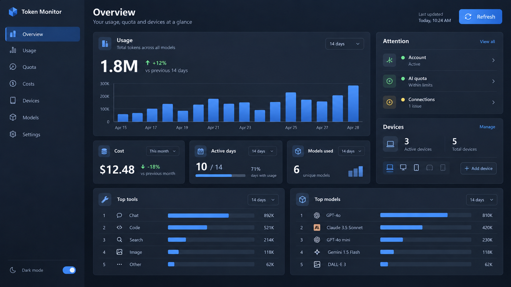
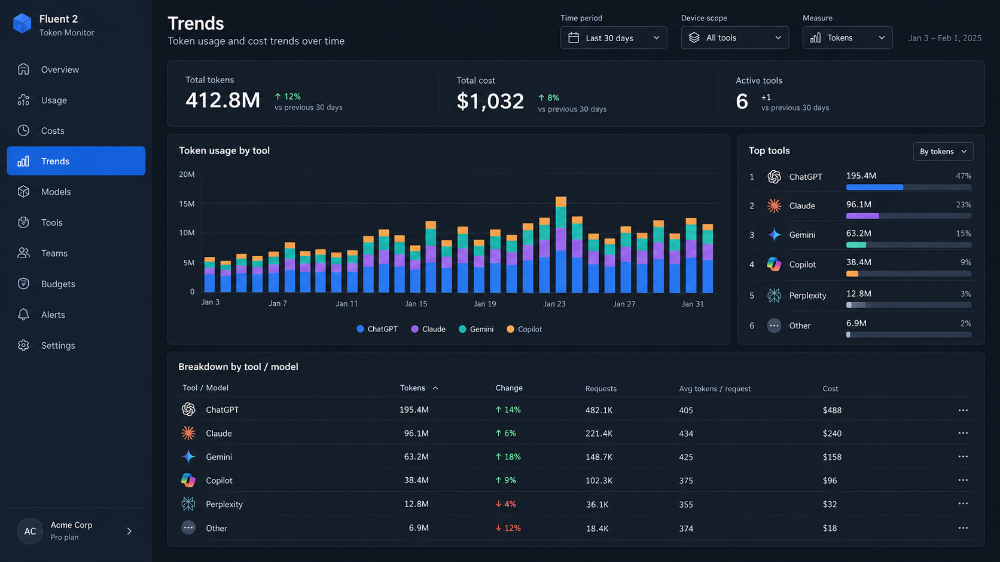
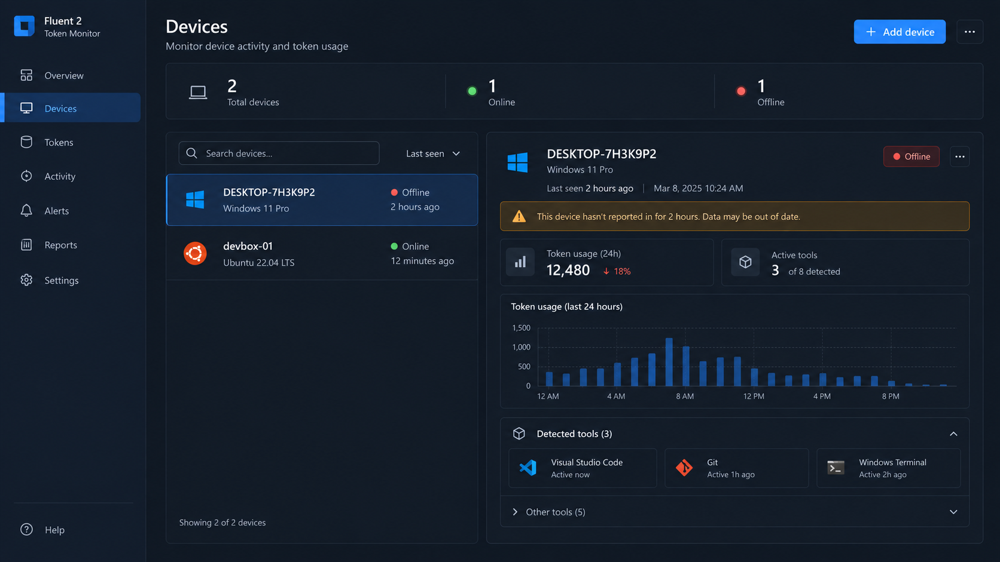
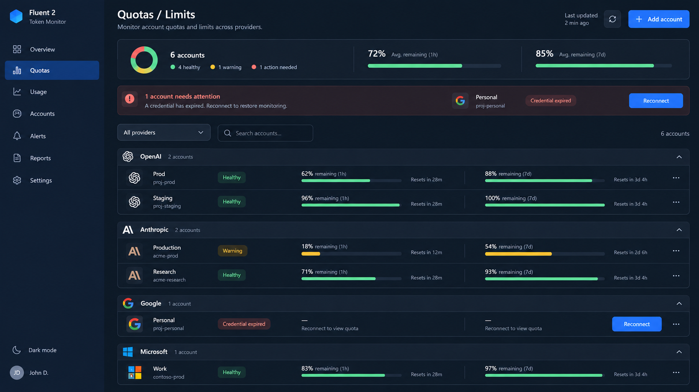
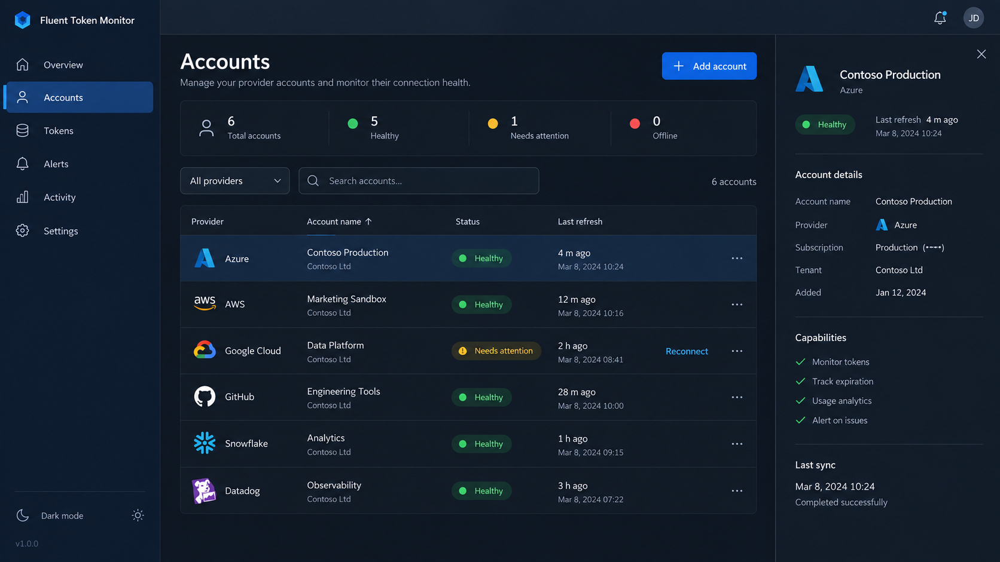
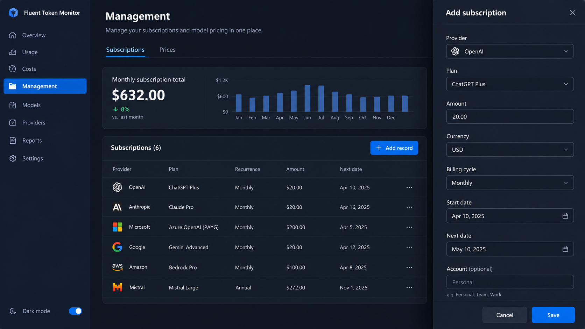
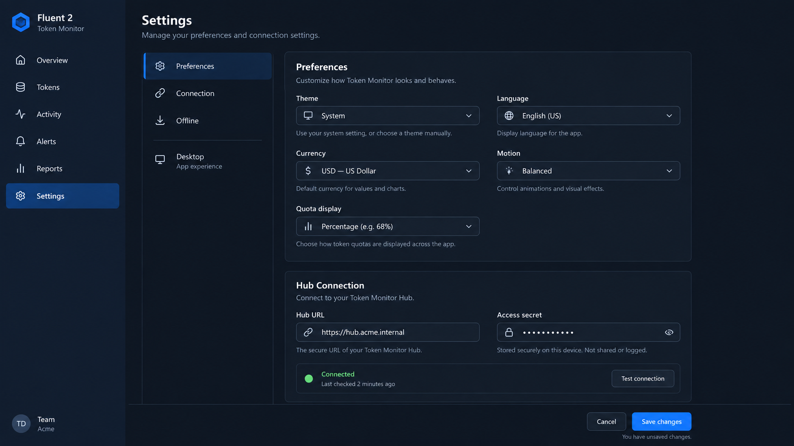
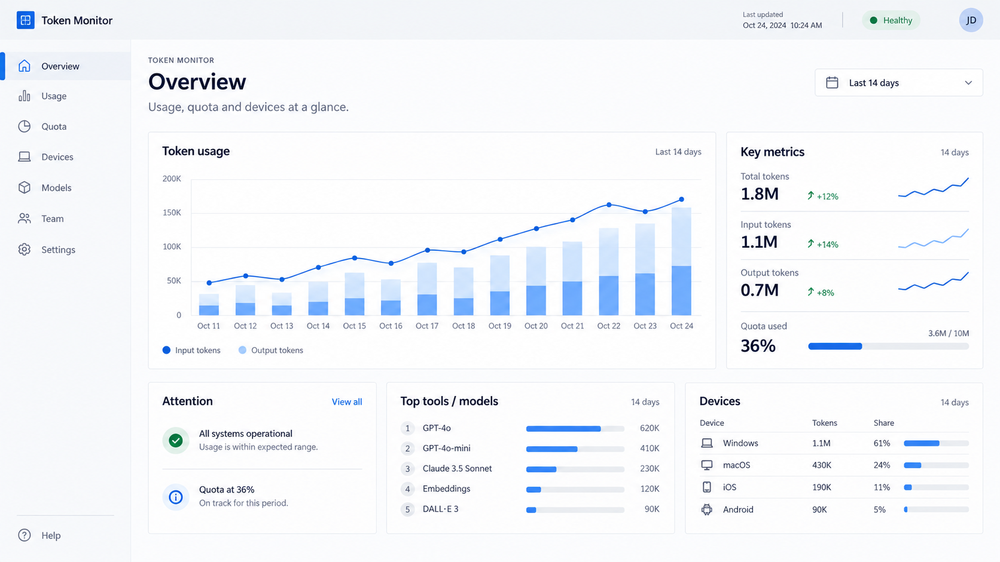

# Token Monitor：Fluent 2 网页端与桌面端重构设计说明

> 2026-09-24。本文只根据本轮提供的 7 张网页截图制定设计方向，未检查页面实现或桌面端画面。配套的 8 张图是生图概念稿，说明布局、层级与气质，不是产品数据、文案或功能清单。实施者应先核对真实页面能力与数据语义，再按本说明重构。

## 1. 先看图，再看规则

| 页面 | 概念图 | 要借鉴的布局判断 |
| --- | --- | --- |
| 总览（深色） | [01-overview-dark.png](fluent2-concepts/01-overview-dark.png) | 一个主要用量区域，旁边是需要关注的状态；次要信息退到下层。 |
| 趋势 | [02-trends-dark.png](fluent2-concepts/02-trends-dark.png) | 筛选有分组，图表是主角，排行和明细为其解释。 |
| 设备 | [03-devices-dark.png](fluent2-concepts/03-devices-dark.png) | 列表与选中设备详情并列；活跃工具先展示，其余按需展开。 |
| 额度 | [04-limits-dark.png](fluent2-concepts/04-limits-dark.png) | 需要处理的异常置顶，账号按服务商组织，额度窗口可以横向比较。 |
| 账号 | [05-accounts-dark.png](fluent2-concepts/05-accounts-dark.png) | 可扫描的账号列表，行级操作收进菜单，异常保留明确处理入口。 |
| 管理 | [06-management-dark.png](fluent2-concepts/06-management-dark.png) | 记录先于表单；新增、编辑时才打开侧边表单。 |
| 设置 | [07-settings-dark.png](fluent2-concepts/07-settings-dark.png) | 二级导航、适中阅读宽度、分组字段与明确保存状态。 |
| 总览（浅色） | [08-overview-light.png](fluent2-concepts/08-overview-light.png) | 同一信息结构如何使用浅色中性色、细描边和少量品牌色。 |

### 概念图的使用边界

- 图中的数字、日期、账号、服务商、设备、图表系列和英文文案均是排版占位；不能据此新增数据、假趋势或默认账号。
- 生成图中出现的 `Fluent 2` 品牌字样、`Add device`、额外导航页、平均额度、重连按钮、功能清单及“安全存储”等文字都不是本项目已验证的能力或安全承诺。应使用实际的 **Token Monitor** 品牌、真实路由、真实操作及经核实的文案。
- 采用图的**信息层级、组件关系、密度、色彩角色和交互模式**；不要逐像素复刻，也不要把图里每个示例卡片照搬到界面。
- 桌面端没有本轮截图。它应与网页端保持同一套 Fluent 2 视觉与共享信息结构，同时根据窗口尺寸和本机／Hub 场景调整内容；桌面端现状及效果必须另行截图验证。

## 2. 截图里已能确认的问题

| 截图 | 可见问题 | 应达到的结果 |
| --- | --- | --- |
| 总览 | 四个同权重的大指标块、宽而厚的图表卡、侧栏多个卡片与底部空状态并列，阅读顺序不明确；“今日 0”与近 14 天有柱状图同时出现，时间语境需更清楚。 | 先说明当前选中范围与主要状态；过去趋势单独标注时间；无数据模块缩为有意义的空状态。 |
| 趋势 | 一排多个带圆点的筛选组占用大量横向空间；统计块、图表和逐条图例都很重。 | 分清“对象／时间／指标／分组”四类控制；图表优先，图例和排行帮助读图。 |
| 设备 | 左列表加右详情的方向正确，但四指标块、明细卡、几十个工具状态标签层层叠加；选中行与操作的视觉重量较高。 | 保留列表详情结构；状态和最近上报时间优先；工具状态汇总、折叠与搜索。 |
| 额度 | 四个总览数字与每个账号的大面积卡片重复表达；大量进度条、状态色和边框让异常账号反而不突出。 | 异常置顶；按服务商和账号形成稳定行结构；额度窗口显示“剩余／已用”的明确语义、重置时间及处理入口。 |
| 账号 | 每一行同时外露刷新、停用、编辑、删除，重复操作盖过账号本身；一条异常虽有提示，但缺少更明确的处置层级。 | 主列表突出服务商、账号、状态和更新时间；常用或异常动作可见，其余进入行菜单。 |
| 管理 | 少量记录被宽大容器包住，新增记录的长表单长期占据主画面；订阅与价格切换区域过于局促。 | 记录浏览是默认任务；Tab 有清楚的选中状态；新增／编辑使用抽屉或独立流程。 |
| 设置 | 二级导航、字段与大容器之间宽度关系失衡，表单横向过长且下方大面积空白；保存动作只服务于当前页的一角。 | 控制阅读宽度、按任务分组；字段标签、说明、状态和保存反馈形成完整流。 |

截图里有浏览器外框、标签栏和疑似其它浮层；它们不是产品 UI 诊断依据。本节仅指出截图可见的视觉与信息组织问题，未推断代码根因。

## 3. 全站视觉和交互规则

### 3.1 一套安静但有层级的 Fluent 2 界面

1. **中性色搭骨架。** 页面底、导航、主要内容面、浮层各有清晰层级。深色主题用偏冷的中性灰拉开细微明度差；浅色主题用浅中性底和白色内容面。减少现在常见的“黑底上放满同样深灰大盒子”。容器只在它真正承载一个概念或交互时出现。
2. **品牌蓝有职责。** 蓝色主要标识当前导航、焦点、主操作、选中状态和必要链接。不要给大片背景、每个图标或每个百分比上蓝。成功、警告、错误色只表达真实状态，并辅以文字或图标；图表系列色与状态色区分。
3. **让空间承担分组。** 采用 Fluent 的 4px 间距体系；控制内部常用 8／12／16，相关元素间常用 16／24，页面区域间常用 24／32，按内容需要调整。相邻内容靠间距和对齐形成关系，避免每一层都画完整边框。[Fluent 2 布局](https://fluent2.microsoft.design/layout)
4. **建立真实字级。** 页面标题接近 Fluent Web `Title 2` 或 `Title 3`，区域标题使用 `Subtitle 1/2`，常规正文使用 `Body 1`，辅助时间与说明使用 `Caption 1`；重要数字可以更大，但不让所有数字争夺主视觉。中英文都要有可靠的系统字体回退，数值列采用齐整数字与一致单位。[Fluent 2 排版](https://fluent2.microsoft.design/typography)
5. **深度克制。** 主要页面面板通常靠背景差和轻描边辨认；菜单、抽屉、弹窗才明显抬高。不要给每个指标、每一行、每个输入框都加粗边和同等级阴影。[Fluent 2 层级](https://fluent2.microsoft.design/elevation)
6. **沿用主题语义令牌。** 设计与实现以 Fluent 2 的 neutral、brand、status 角色及浅／深主题 token 为依据，而不是按概念图像素取色。若需要产品品牌色，用同一品牌色阶构建交互态与可访问的对比度。[Fluent 2 色彩](https://fluent2.microsoft.design/color)、[色彩 token](https://fluent2.microsoft.design/color-tokens)

### 3.2 页面骨架

- 全局导航固定在左侧，页面按“分析／资源／管理”组织；同级导航采用一致图标尺寸、文本基线、行高与选中方式。网页和桌面端共享信息架构；桌面端窄窗口可收起导航。不要照搬概念图里虚构的菜单项。
- 页面顶部始终回答三个问题：**这是哪页、当前看的是哪段数据、此页最主要的动作是什么**。标题、简短说明、数据更新时间和操作按重要性排列；只有需要的页面才有筛选栏。
- 大屏主内容设置舒适的最大阅读宽度，避免在超宽屏上把每个卡片拉到 1800px；图表可更宽，表单和文字更窄。每页使用有意安排的主／次区域，而不是机械的四等分卡片网格。
- 顶部筛选只放影响当前页内容的控制；图表内部控制放在图表标题附近。范围、时间、指标和分组各只出现一次。工具栏中的动作分组清楚，空间不足时进溢出菜单，不能换成两排凌乱按钮。[Fluent 2 Toolbar](https://fluent2.microsoft.design/components/web/react/core/toolbar/usage)

### 3.3 组件选择按任务，不按“哪里能塞卡片”

| 任务 | 优先使用的 Fluent 2 模式 | 判定标准 |
| --- | --- | --- |
| 同层级页面导航 | 导航项与清晰选中态 | 链接负责切页，Button 负责执行动作。 |
| 同页少量紧密相关的内容切换 | `Tablist` | 订阅／价格适合；超过容器宽度或层级无关时改导航／下拉。[规范](https://fluent2.microsoft.design/components/web/react/core/tablist/usage) |
| 一种对象的简明摘要 | `Card` | 每张卡只讲一个概念，标题、内容、操作有明确次序；不能把整页所有层级都套卡。[规范](https://fluent2.microsoft.design/components/web/react/core/card/usage) |
| 可横向比较的账号、订阅或设备属性 | `Table`／`DataGrid` | 有列语义就用表；每行只保留关键字段，窄屏转为可读列表，不靠横向挤压。 |
| 简单重复信息 | `List` | 行可扫描，主动作明确；次动作按需显示。[规范](https://fluent2.microsoft.design/components/web/react/core/list/usage) |
| 不可编辑的在线、离线、正常、异常等状态 | `Badge` 加文字 | Badge 靠近其对象，尺寸统一；不要把状态伪装为可删的 Tag。[Badge](https://fluent2.microsoft.design/components/web/react/core/badge/usage)、[Tag](https://fluent2.microsoft.design/components/web/react/core/tag/usage) |
| 页面或区域级失效、陈旧、权限问题 | `MessageBar` | 告诉用户影响及可执行的下一步；字段错误留在字段旁。[规范](https://fluent2.microsoft.design/components/web/react/core/messagebar/usage) |
| 输入和选择 | `Field` 包裹合适的输入组件 | 标签在上，说明与校验就近；宽度匹配预期内容，不是默认拉满。[规范](https://fluent2.microsoft.design/components/web/react/core/field/usage) |
| 新增／编辑较长记录 | 抽屉或独立编辑流程 | 浏览画面不长期露出完整表单；抽屉里保存与取消固定可见。 |
| 删除或不可逆操作 | 确认对话框 | 危险色只用于确有风险的动作，焦点和取消路径清楚。 |

### 3.4 数据可读性与状态设计

- **零、无数据、载入、未连接、陈旧、权限失效分开。** `0` 只表示已确认的真实零值；无资料用简短说明、作用范围与下一步；载入可用骨架屏；陈旧数据保留可辨认的最后值并标明更新时间，避免被误看作实时。
- **所有指标都显示范围与单位。** “今日 Token”“近 14 天用量”“本月费用”不可用同一个未标注的全局时间筛选暗示全部同时变化。趋势对比只有基准可靠时才显示；额度必须写清“剩余”还是“已用”、窗口和重置时间。
- 图表有可读轴、单位、日期、图例和键盘可达的数据解释；柱形图从零开始，颜色数量节制，长尾合并为“其它”或改用可检索明细。没有数据时保留图表区域标题和解释，不渲染一个空的大坐标框。
- 不用仅靠绿色／红色判断状态。普通文本与背景的对比度至少 4.5:1，大字号至少 3:1；图表和状态符号也要能辨认。[Fluent 2 排版与对比度](https://fluent2.microsoft.design/typography)、[Fluent 2 色彩与可访问性](https://fluent2.microsoft.design/color)

## 4. 七页改造说明

### 4.1 总览

- 首屏目标：三秒内看清当前时间／设备范围、主要用量、是否有需要处理的额度或连接问题。
- 让近期用量图表成为主区域，数字直接附着在相关内容上；费用、设备与状态作为次区域。不是所有数据都需要占一个 1/4 宽卡片。
- 右侧“需要关注”只在确有异常时突出；正常情况用简洁的健康摘要，不制造虚假告警。设备摘要给出在线／离线和最近上报，点击进入设备详情。
- 工具与模型排行采用紧凑列表。有真实统计才展示；无统计时一块有解释的空状态足够，不重复两块巨大虚线占位。
- 总览里的“今日”与趋势里的“近 14 天”可以同时存在，但每个数值／图表必须就近说明自身时间范围。

### 4.2 趋势

- 页首采用一条紧凑筛选区：设备范围、时间范围、度量（Token／费用／活跃时间）和分组（工具／模型）各有明确控制。不要把这些离散选项全部画成带圆点的胶囊。
- 主图占最大视觉权重；对应标题、单位、时间粒度、系列颜色和图例在同一个视域内。统计摘要与选定时间一致，重复的“Token／费用”切换只保留一次。
- 图旁排行解释贡献，图下明细用于精确比较。排行榜和明细只能使用真实可提供的数据字段；示例图中的请求数、变化率等并非功能要求。
- 系列颜色必须与告警色区分，图例能单独切换或解释系列时要有清楚的选中与键盘状态。

### 4.3 设备

- 保留“设备列表—选中设备详情”结构；列表行只显示名称、平台、在线／离线、最后上报。详情标题明确当前设备及数据是否陈旧。
- 统计摘要简短；详情先展示此设备所选期间用量与核心工具，再提供更完整数据。
- 把截图中几十个“未发现／活跃”标签改成“已检测／活跃／未检测”汇总、少量高相关条目和可展开列表。若搜索、过滤或分组当前不存在，作为实施时的产品决策，不能仅因概念图画了就默认新增。
- 重命名、移除这类管理动作属于行菜单或详情的操作区；移除有确认流程。没有真实“添加设备”能力时，删除概念图的该按钮。

### 4.4 额度

- 页首摘要只回答健康账号数和需要行动数；失效凭据、采集失败或接近耗尽的账号要有清楚的优先级和可执行入口。
- 下方按服务商归组，每个账号一行／一块紧凑条目。每个额度窗口标注名称、**剩余或已用**百分比、重置时间及上次获取时间；有多个窗口时遵守同一顺序。
- 进度条的视觉强度随风险改变；100% 剩余可用中性或温和表达，避免整页充满绿色。没有额度值与失效凭据是不同状态，不把缺失当作 0%。
- 顶部服务商筛选与账号数量要在一条可读的工具行中，窄宽度不能把“服务商”拆成竖排字符。

### 4.5 账号

- 主任务是找账号、看状态、解决故障。列表按服务商／账号／状态／更新时间组织；支持合适的搜索、筛选与排序时，控制放在列表上方。
- 刷新、启停、编辑、删除不必在每一行永久显示四个按钮。行菜单承载次级动作；失效账号可额外露出与其问题匹配的主处理动作。
- 选中账号可开详情面板，展示非敏感元数据和失败原因；真实凭据不在详情中回显。图中的 Azure、AWS 等服务商和“Capabilities”只是示意。
- “正常”“凭据失效”“更新失败”“已停用”需要不同文字、图标和处理方式，不能都压成一个颜色标签。

### 4.6 管理

- “订阅”和“价格”是同页紧密相关内容，可使用一致的 Tablist。默认显示记录、汇总与新增入口，而非永久展开输入表单。
- 记录用可扫描的表或列表；月度汇总如有可靠计算可作为一个次要洞察，不能让图中示例数字代替实际计算。
- 点“新增／编辑”后才打开侧边抽屉；字段按服务商／方案、金额与币种、周期与日期、关联信息分组。表单标签在上，错误说明就近，保存／取消固定可达。
- 价格页也沿用同一骨架，但展示其自身字段和操作，不强迫价格规则套用订阅表单。

### 4.7 设置

- 保留二级分类，但使分类和内容面板的宽度各司其职。设置表单用适中列宽，控制宽度由内容决定；页右侧可以留自然空白，不需用一整块深灰背景填满。
- 外观、语言、货币、动态效果等网页偏好归为一组；连接、访问、离线壳及桌面专属设置根据宿主能力分别展示。不得把网页中不可用的桌面配置做成看似可操作的控件。
- Hub 连接及密钥相关项使用明确标签、掩码、状态、保存反馈。生成图中的“安全存储”是虚构文案；任何安全承诺应以项目真实实现与现有产品文案为准。
- 仅在有未保存变更时强调保存动作；字段校验、保存中、成功、失败和离开页面时的未保存提醒形成闭环。桌面端本地模式下仍应可进入有效设置。

### 4.8 浅色主题和适配

- 浅色与深色使用相同的信息结构、品牌职责和状态语义，分别用 Fluent 2 token 建立表面层级。不要把深色值简单反相。
- 宽屏维持主／次区域；中等窗口把右侧信息移到主图下方；窄窗口导航收起、筛选按任务换行或进入菜单、列表变为纵向条目。缩窄时先改变结构，再缩小间距或字号。[Fluent 2 响应式布局](https://fluent2.microsoft.design/layout)
- 浏览器页面至少检查宽桌面、普通笔记本和窄视口；桌面端至少检查常用窗口与缩放。图表、表、抽屉、下拉和焦点状态都要在两种主题下验收。

## 5. 给实施对话的执行与验收任务

> 请根据 `docs/design/fluent2-screenshot-redesign-brief.md` 和同目录八张概念图重构 Token Monitor 网页端与桌面端 UI。先核对现有页面能力、数据语义、共享 UI 结构与 `AGENTS.md`，再实施。目标是 Fluent 2 的页面结构、组件关系、信息层级、交互状态、主题与响应式行为整体一致，不是仅替换组件或调 CSS。图片中的数字、日期、服务商、导航和按钮都是视觉占位；不要据图创造功能或安全承诺。保留实际有用的数据与操作，允许为了任务流程重排或收纳显示内容。逐页完成总览、趋势、设备、额度、账号、管理、设置，并检查使用情况页与全局导航是否延续同一规则。网页和桌面端分别截图验收；记录每页的改前／改后、深色／浅色、正常／空／错误／陈旧状态，以及窄窗口、键盘和缩放表现。按项目既有验证命令完成自动检查，但不能用构建通过代替视觉与交互验收。

验收时至少确认：

1. **视觉一致：** 各页导航选中、标题、间距、字级、边框、表面与按钮强弱一致；蓝色和状态色有明确职责；没有靠大量同尺寸卡片撑起页面。
2. **信息清楚：** 每页首屏能找到主要结论和下一步；所有时间范围、单位、状态新鲜度可见；无数据和真实零值区分。
3. **组件合适：** Tab 只切相关内容，表承载可比较数据，Badge 只表达状态，长表单不常驻，危险操作有确认，重复行操作有合理收纳。
4. **可操作：** 筛选、列表选中、行菜单、抽屉、表单、保存反馈、图表说明和空状态都能用鼠标与键盘完成；焦点可见，弹层不遮挡关键内容。
5. **跨宿主／适配：** 网页、Electron 的实际可用能力与文案准确；本机与 Hub 相关状态清楚；常见桌面宽度、窄窗口、缩放以及浅／深色均无内容裁切、标签竖排或操作溢出。

## 6. 生图提示词集

八张图使用内置 imagegen 生成，类型均为 `ui-mockup`。共同提示词为：**16:9 高保真、纯平面 Fluent 2 Token Monitor 网页 UI；无浏览器外框；冷调中性色、微弱层级与描边、Segoe 风格字级、4px 间距、克制蓝色品牌态、语义状态色；短英文占位文案；禁止玻璃态、霓虹、大片渐变、巨型同权重指标卡、密集圆点筛选。** 每张图的页面提示分别是：

| 图 | 页面提示的核心要求 |
| --- | --- |
| 01 | 总览：一块主用量图、紧凑费用／活跃日／设备指标、关注事项、工具和模型排行。 |
| 02 | 趋势：时间／设备／度量控制，一张可读主图，右侧排行，下方工具／模型明细。 |
| 03 | 设备：两设备列表与选中详情，离线及陈旧说明，少量活跃工具及其余折叠。 |
| 04 | 额度：异常账号优先、服务商分组、短周期与周周期剩余额度和重置时间。 |
| 05 | 账号：状态汇总、可扫描账号表、行菜单、异常处置和非敏感详情面板。 |
| 06 | 管理：订阅／价格标签、记录表，新增时打开带字段和固定操作的侧边抽屉。 |
| 07 | 设置：分类导航、适中宽度分组字段、Hub 连接与掩码密钥、保存状态。 |
| 08 | 浅色总览：维持总览层级，以浅中性色、白色内容面、少量蓝色验证主题一致性。 |

## 7. 官方设计依据

本说明的规则以 [Fluent 2 设计原则](https://fluent2.microsoft.design/design-principles)、[布局](https://fluent2.microsoft.design/layout)、[色彩](https://fluent2.microsoft.design/color)、[排版](https://fluent2.microsoft.design/typography)、[层级](https://fluent2.microsoft.design/elevation)及上文链接的对应组件用法为依据；具体实现应以这些规范与项目当前组件版本共同校验。
